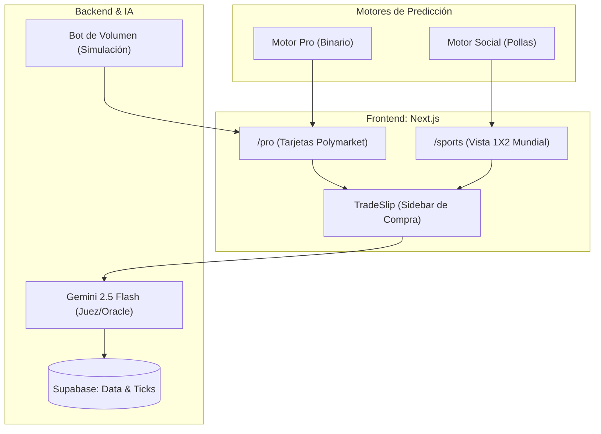

# Arquitectura de Software: PredicFi Protocol

Esta documentación detalla el flujo técnico, la interacción entre capas y la lógica de negocio del mercado de predicción.

## 1. Flujo del Usuario: Estrategia Dual
PredicFi opera con dos motores complementarios para maximizar la retención y la viralidad.



## 2. Infraestructura Backend: Oráculo & Admin
Representación del "Back-office" y el proceso autónomo de resolución mediante **Gemini 2.5 Flash**.

```mermaid
graph TD
    %% Estilos
    classDef admin fill:#fdf4ff,stroke:#d946ef,stroke-width:2px,color:#86198f
    classDef ai fill:#fffbeb,stroke:#f59e0b,stroke-width:2px,color:#b45309
    classDef db fill:#f0fdf4,stroke:#22c55e,stroke-width:2px,color:#15803d
    classDef chain fill:#f8fafc,stroke:#94a3b8,stroke-width:2px,stroke-dasharray: 5 5,color:#475569

    subgraph Acceso Restringido
        Login{Check: miaencantos@gmail.com} -->|Aprobado| AdminPanel["/admin (Dashboard)"]:::admin
    end

    subgraph Panel de Control (Admin)
        AdminPanel --> Treasury[Ver TVL y Comisiones]
        Treasury --> Withdraw[Transacción: Retirar Fees]:::chain
        AdminPanel --> Emergency[Pausar Factory / Emergency Stop]:::chain
    end

    subgraph Oracle Worker (Proceso Node.js Independiente)
        Cron((Cron Job / Bucle)) --> QueryDB[Consultar Supabase]:::db
        QueryDB -->|Busca status='active' & expiration < NOW| Fetch[Extraer Mercados Expirados]
        
        Fetch --> Context[Inyectar Fecha Actual y Contexto]
        Context --> Gemini[API Gemini 2.5 Flash]:::ai
        
        Gemini -->|JSON: outcome, reason| Parse[Validar Formato]
        Parse --> ResolveTX[Transacción: resolveMarket]:::chain
    end

    subgraph Cierre del Ciclo
        ResolveTX --> Indexer[Indexer detecta MarketResolved]
        Indexer --> UpdateDB[(Supabase: status, resolution_reason)]:::db
        UpdateDB -.->|Desbloquea reclamos| UserDashboard([Frontend: Usuarios cobran])
    end
```

## Stack Tecnológico Oficial
- **Frontend:** Next.js 16 (App Router) + Tailwind CSS (Light Theme).
- **Web3 SDK:** Thirdweb v5 (Base Sepolia).
- **Base de Datos:** Supabase (PostgreSQL + Real-time Subscriptions).
- **IA:** Gemini 2.5 Flash (Moderación y Oráculo).
- **Blockchain:** Base Sepolia (L2 Ethereum).
- **Smart Contracts:** Solidity 0.8.24 (Clones EIP-1167, Permit EIP-2612).
